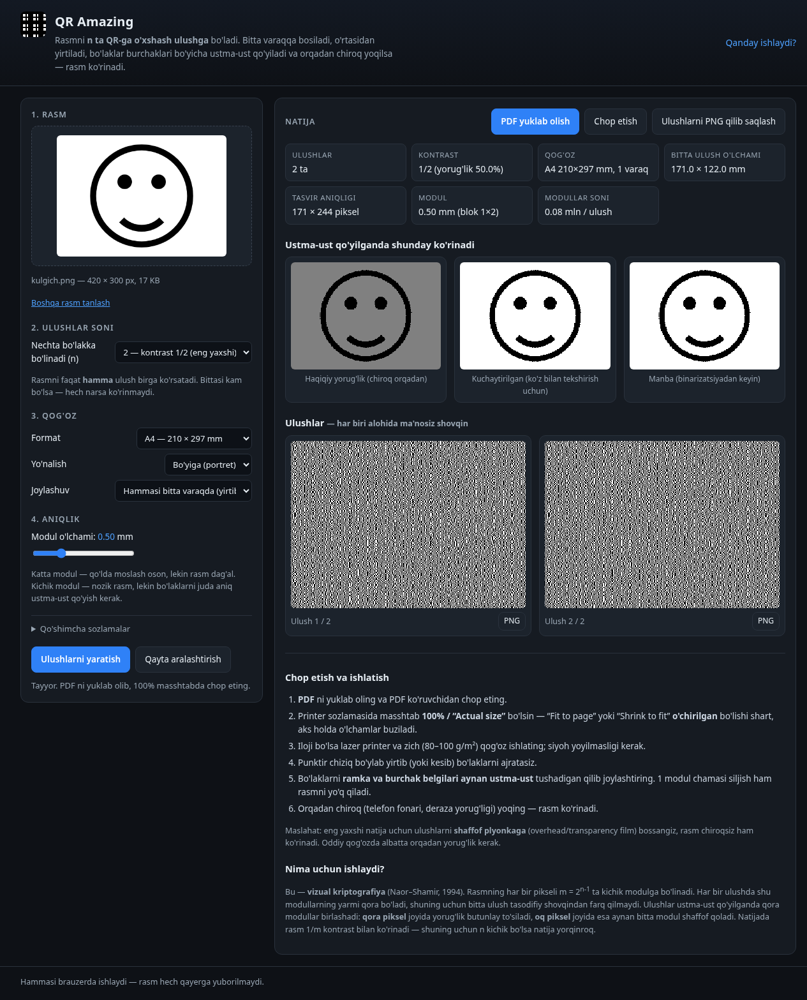
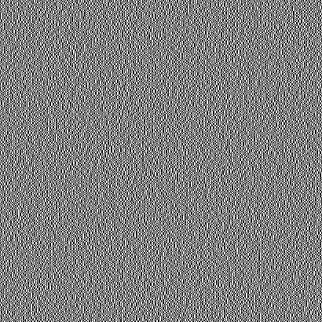
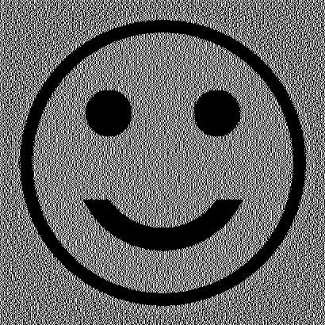
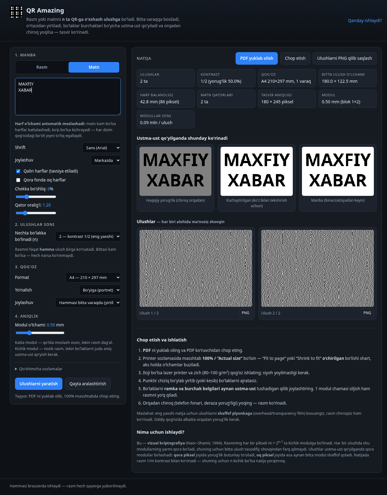

# QR Amazing — rasmni QR-ga o'xshash ulushlarga bo'lish

Brauzerda ishlaydigan ilova: **rasm yuklanadi** (JPG / PNG / BMP) yoki **matn yoziladi**,
so'ng **ulushlar soni n** (2 dan 8 gacha) va **qog'oz formati** (A4, A3, A5, A6, Letter, Legal) tanlanadi.
Natijada tanlangan qog'ozga **n ta bir xil o'lchamdagi QR-ga o'xshash naqsh** chiqadi.

Ularni chop etib, punktir chiziq bo'ylab **yirtib**, bo'laklarni **burchak belgilari bo'yicha
ustma-ust** qo'yib, **orqadan chiroq** yoqilsa — yuklangan rasm ko'rinadi.

Bitta bo'lakning o'zi ma'nosiz shovqin: rasm faqat **barcha n ta ulush birga** bo'lganda paydo bo'ladi.



| Manba rasm | Bitta ulush (1/2) | Ikki ulush ustma-ust |
|---|---|---|
|  |  |  |

> **Eslatma:** bu naqshlar QR kodga *o'xshaydi*, lekin skaner qilinadigan haqiqiy QR kod emas.
> Ular — vizual kriptografiya ulushlari.

## Matn rejimi

Rasm o'rniga to'g'ridan-to'g'ri matn yozish mumkin — **harf o'lchami matn hajmiga qarab
avtomatik moslashadi**: matn kam bo'lsa harflar kattalashadi, ko'p bo'lsa kichrayadi,
ya'ni qog'ozdagi bo'sh joy har doim to'liq ishlatiladi.



A4, 2 ulush, modul 0.5 mm (bitta ulush maydoni 180 × 122.5 mm) misolida o'lchangan natija:

| Matn | Qatorlar | Harf balandligi |
|---|---|---|
| `SALOM` | 1 | **46.8 mm** (94 piksel) |
| `Tug'ilgan kuning bilan, aziz do'stim! Omad va baxt tilaymiz.` | 4 | **19.7 mm** (39 piksel) |
| 6 marta takrorlangan uzun jumla | 10 | **8.9 mm** (18 piksel) |
| 120 marta takrorlangan jumla | 60+ | 3.7 mm — ilova *“harflar juda kichik”* deb ogohlantiradi |

Sozlamalar: shrift (Sans / Serif / Monospace / tizim), joylashuv (markaz / chap / o'ng),
qalin harflar, qora fonda oq harflar, chekka bo'shliq va qator oralig'i.
`Enter` bilan qator ko'chirish saqlanadi, juda uzun so'z avtomatik bo'linadi.

Matn rejimida:
- tasvir **butun bo'sh maydonni egallaydi** (rasm rejimida esa rasmning nisbati saqlanadi);
- binarizatsiya `dithering` emas, **aniq chegara** bilan bajariladi — harflar chetlari toza chiqadi;
- natija o'qilishi uchun harf balandligi tiklanadigan tasvirda **9 pikseldan katta** bo'lishi kerak,
  ilova buni tekshirib ogohlantiradi. Qalin shrift va qisqa matn eng ishonchli natija beradi.

Namuna: [`docs/namuna-matn-a4.pdf`](docs/namuna-matn-a4.pdf) — “MAXFIY XABAR” matni, A4, 2 ulush.

---

## Tez boshlash

O'rnatish, `npm install` va internet kerak emas — istalgan yo'lni tanlang:

**1. Bitta fayl (eng oson).** `dist/qr-amazing.html` ni yuklab olib brauzerda ochasiz.
CSS va JS shu faylning ichida, shuning uchun server kerak emas.

**2. Repozitoriyani yuklab olib `index.html` ni ochish.** Bu ham ishlaydi:
`file://` orqali brauzer ES modullarni bloklaganda sahifa avtomatik ravishda
`dist/qr-amazing.js` (klassik bundle) ga o'tadi.

**3. Lokal server** (ishlab chiqish uchun — modullar `src/` ichida alohida turadi):

```bash
python3 -m http.server 8000
# so'ng brauzerda: http://localhost:8000/index.html
```

**4. GitHub Pages.** Pages ni `main` branch / root papkaga ulasangiz, `index.html` to'g'ridan-to'g'ri ishlaydi.

Rasmni yuklashning uch usuli: **“Faylni tanlash”** tugmasi, rasmni **sahifaning istalgan joyiga tashlash**,
yoki **Ctrl/Cmd + V** bilan qo'yish.

Rasm hech qayerga yuborilmaydi — barcha hisob-kitob brauzerning o'zida bajariladi.

---

## Qanday ishlaydi

Bu — **vizual kriptografiya** (Naor–Shamir, 1994) ning `(n, n)` sxemasi.

1. Rasm kulrangga o'tkaziladi va **dithering** (Floyd–Steinberg va h.k.) bilan qora/oq holatga keltiriladi.
2. Har bir piksel **m = 2⁽ⁿ⁻¹⁾** ta kichik kvadratga (**modul**) bo'linadi.
3. Har bir ulushda shu modullarning **aynan yarmi** qora bo'ladi — piksel qora yoki oq bo'lishidan
   qat'i nazar. Shuning uchun bitta ulush tasodifiy shovqindan statistik jihatdan farq qilmaydi.
4. Qaysi modullar qora bo'lishi tasodifiy tanlanadi, lekin shunday tanlanadi-ki, ulushlar
   ustma-ust qo'yilganda (qora modullar birlashadi, ya'ni `OR` amali):
   - **qora piksel** joyida barcha modullar to'siladi → yorug'lik o'tmaydi;
   - **oq piksel** joyida aynan bitta modul shaffof qoladi → yorug'likning `1/m` qismi o'tadi.

Natijada rasm **1/m kontrast** bilan ko'rinadi. Shuning uchun n kichik bo'lsa natija yorqinroq:

| n (ulushlar) | m = 2ⁿ⁻¹ | Piksel bloki | Oq joydan o'tgan yorug'lik | Amaliy baho |
|---|---|---|---|---|
| 2 | 2 | 1×2 | 50% | ★★★ eng yaxshi |
| 3 | 4 | 2×2 | 25% | ★★★ yaxshi |
| 4 | 8 | 2×4 | 12.5% | ★★ ko'rinadi |
| 5 | 16 | 4×4 | 6.25% | ★ xira |
| 6 | 32 | 4×8 | 3.1% | juda xira |
| 7–8 | 64–128 | 8×8, 8×16 | 1.6–0.8% | faqat tajriba uchun |

n ortsa aniqlik ham tushadi: bir varaqda joy o'zgarmaydi, lekin bitta piksel uchun m ta modul kerak.

---

## Sozlamalar

| Sozlama | Nima qiladi |
|---|---|
| **Manba: Rasm / Matn** | Rasm yuklash yoki matn yozish. Matnda harf o'lchami avtomatik moslashadi. |
| **Ulushlar soni (n)** | Tasvir nechta bo'lakka bo'linadi. Hammasi kerak, biri kam bo'lsa — hech narsa ko'rinmaydi. |
| **Qog'oz formati / yo'nalishi** | Bosma varaq o'lchami. Ulush o'lchami shundan kelib chiqib hisoblanadi. |
| **Joylashuv** | `Bitta varaqda` — n ta ulush bitta varaqqa joylashadi va yirtib ajratiladi. `Har biri alohida varaqda` — ulushlar kattaroq chiqadi (aniqlik yuqori), lekin qirqib tenglashtirish kerak. |
| **Modul o'lchami (mm)** | Bitta kichik kvadratning tomoni. Katta modul — qo'lda moslash oson, rasm dag'al. Kichik modul — nozik rasm, lekin siljishga juda sezgir. 0.4–0.7 mm amalda qulay. |
| **Chegara / yirtish yo'lagi** | Varaq chetidagi bo'sh joy va ulushlar orasidagi yirtish zonasi. |
| **Binarizatsiya** | `Floyd–Steinberg`, `Atkinson` — fotolar uchun; `Bayer` — naqshli; `Oddiy chegara` — logotip va matn uchun. |
| **Yorqinlik / kontrast / gamma / avto-darajalar / invert** | Binarizatsiyadan oldingi tuzatishlar. Kontrastli, sodda rasmlar eng yaxshi natija beradi. |

---

## Chop etish

1. **PDF yuklab olish** tugmasini bosib PDF ni oling (PDF ichida ulushlar **1 bitli rasm** sifatida,
   aniq millimetrlarda joylashtirilgan — printer o'z aniqligida bosadi).
2. Chop etish oynasida masshtab **100% / "Actual size"** bo'lsin.
   **"Fit to page" / "Shrink to fit" o'chirilgan** bo'lishi shart — aks holda o'lchamlar buzilib,
   ulushlar bir-biriga mos kelmaydi.
3. Lazer printer va zich (80–100 g/m²) qog'oz afzal; siyoh yoyilmasligi kerak.
4. Punktir chiziq bo'ylab yirtib yoki kesib bo'laklarni ajratasiz.
5. Bo'laklarni **ramka va burchak belgilari aynan ustma-ust** tushadigan qilib joylashtiring.
   Bir modul chamasi siljish rasmni yo'q qiladi.
6. Orqadan chiroq (telefon fonari, deraza) yoqing.

**Maslahat:** eng yaxshi natija — ulushlarni **shaffof plyonkaga** (overhead/transparency film)
bosish; unda rasm chiroqsiz ham ko'rinadi. Oddiy qog'ozda esa orqadan yorug'lik shart,
chunki qog'ozning o'zi yorug'likni tarqatadi va kontrastni pasaytiradi.

### Amaliy cheklovlar

- Qo'lda moslash aniqligi odatda ±0.3–0.5 mm. Shuning uchun modul 0.4 mm dan kichik bo'lsa
  natijaga erishish qiyin.
- n = 2 yoki 3 da natija ishonchli ko'rinadi; n ≥ 5 da yorug'lik shunchalik kam-ki,
  oddiy qog'ozda deyarli hech narsa ko'rinmaydi (ilova bu haqda ogohlantiradi).
- Qog'oz cho'zilishi/namligi va printer geometriyasi ham xatoga olib keladi —
  barcha ulushni **bitta varaqdan** olish (`Bitta varaqda` rejimi) eng aniq usul.

---

## Loyiha tuzilishi

```
index.html              UI; yuklovchi http(s) da modullarni, file:// da bundle ni oladi
styles.css              Uslublar
src/
  vc.js                 (n,n) vizual kriptografiya: matritsalar, kodlash, simulyatsiya
  image.js              kulranglash, o'lcham o'zgartirish, tuzatish, dithering
  text.js               matnni qatorlarga bo'lish + avtomatik shrift o'lchami
  layout.js             qog'oz formatlari, setka, modul/piksel hisoblari
  pdf.js                minimal PDF generatori (1 bitli rasm, chiziq, matn)
  sheet.js              layout + ulushlar -> chop etishga tayyor PDF
  bmp.js                zaxira BMP dekoderi
  app.js                UI mantiqi
build.mjs               dist/ ni yig'adi (bitta HTML + klassik bundle)
dist/qr-amazing.html    serversiz ochiladigan bitta faylli versiya
dist/qr-amazing.js      index.html uchun zaxira klassik bundle
test/
  run-tests.mjs         yadro testlari (Node)
  browser-e2e.js        brauzerdagi to'liq tekshiruv skripti (rasm rejimi)
  text-e2e.js           matn rejimi: avtomatik masshtab va PDF
  text-e2e-2.js         matn rejimi: ogohlantirishlar, shriftlar, tab almashish
  upload-debug.js       rasm yuklash yo'llarini tekshirish skripti
  pdf-base64.js         PDF ni faylga chiqarib tekshirish uchun yordamchi
  png.mjs               testlar natijasini PNG qilib yozish
```

Tashqi kutubxona ishlatilmagan: PDF, PNG, BMP va dithering — hammasi shu repozitoriyada.

---

## Testlar

```bash
node test/run-tests.mjs   # 111 ta tekshiruv; natija tasvirlari test/out/ ichida
node build.mjs            # dist/ ni qayta yig'ish
```

Testlar quyidagilarni isbotlaydi:

- har bir `n = 2…8` uchun ulushlar ustma-ust qo'yilganda **asl tasvir aynan tiklanadi**
  (qora piksel → 0 shaffof modul, oq piksel → 1 shaffof modul);
- har bir ulushning har bir bloki **aynan m/2 qora modul**ga ega, ya'ni bitta ulush
  (va hatto n−1 ta ulush) rasm haqida hech qanday ma'lumot bermaydi;
- qog'oz/yo'nalish/rejim/n ning barcha kombinatsiyalarida ulushlar varaq ichiga sig'adi,
  bir xil o'lchamda bo'ladi va rasm nisbati saqlanadi;
- yaratilgan **PDF strukturasi yaroqli** (xref ofsetlari, oqim uzunliklari) va PDF ichidagi
  rasm baytlari ulush massiviga **bit darajasida mos**;
- BMP dekoderi va rasm tayyorlash quvuri to'g'ri ishlaydi;
- **matn avtomatik masshtabi**: matn ko'paysa shrift kichrayadi, maydon kattalashsa kattalashadi,
  topilgan o'lcham har doim eng kattasi (1 px kattasi endi sig'maydi), `\n` va uzun so'zlar
  to'g'ri ishlanadi, bo'sh yoki juda kichik maydonda ham xato bermaydi.

Brauzer tekshiruvi (agent-browser yoki Playwright bilan):

```bash
# to'liq yo'l: yuklash -> yaratish -> PDF -> n=4 -> BMP/JPEG -> n=8
agent-browser --session x open "file://$PWD/dist/qr-amazing.html" \
  && agent-browser --session x eval --stdin < test/browser-e2e.js

# faqat rasm yuklash yo'llari (tugma, drag&drop, takroriy tanlash, xato fayl)
agent-browser --session y open "file://$PWD/index.html" \
  && agent-browser --session y eval --stdin < test/upload-debug.js

# matn rejimi (avtomatik masshtab, ogohlantirishlar, PDF)
agent-browser --session z open "file://$PWD/dist/qr-amazing.html" \
  && agent-browser --session z eval --stdin < test/text-e2e.js \
  && agent-browser --session z eval --stdin < test/text-e2e-2.js
```
